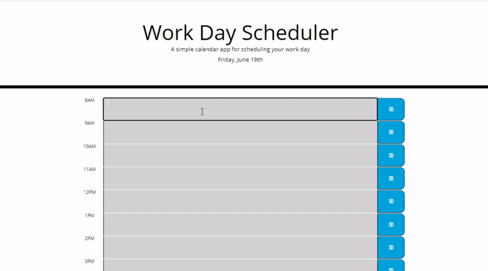

Day Planner Javascript Program (Using JQuery and Third Party APIs)

# Day Planner Guidelines

This is an JavaScript application created to create a simple calendar application that allows the user to save events for each hour of the day. This application will run in the browser and feature dynamically updated HTML and CSS powered by jQuery. The client hopes that will application will allow employees to manage their time effectively by scheduling important events to digital daily planner.

This application will be using the [Moment.js](https://momentjs.com/) library to work with date and time. The client also requested that the application maintain a clean and polished user interface, that it was responsive, ensuring that it adapts to multiple screen sizes, and that it run in the browser, featuring dynamically updated HTML and CSS powered by the JavaScript code. 

The specific features of the application are outlined in the acceptance criteria provided by the client. 

# Acceptance Criteria Requirements:

Functional, deployed application includes the following:

* A daily planner to create a schedule

* Upon  opening the planner, the user will see the current day displayed at the top of the calendar

* When the user scrolls down, they are presented with timeblocks for standard business hours

* Each timeblock is color coded to indicate whether it is in the past, present, or future for the timeblocks of that day

* Upon clicking into a timeblock, the user can enter an event

* User can click a save button for that timeblock and save the text for that event in local storage

* Upon refreshing the page, the saved events persist

The following animation demonstrates the client's request for application functionality:

Client Demo:

Application Demo: 

Validation of Site Available Here: 

# Criteria Determination: 

This application provides a fully responsive JavaScript program using jQuery and Third Party APIs for the client to provide a scheduling solution for their employees while ensuring that responsiveness and utility is not affected. 

For additional information, please e-mail the project manager Summer Healey: summerleigh.healey@gmail.com
